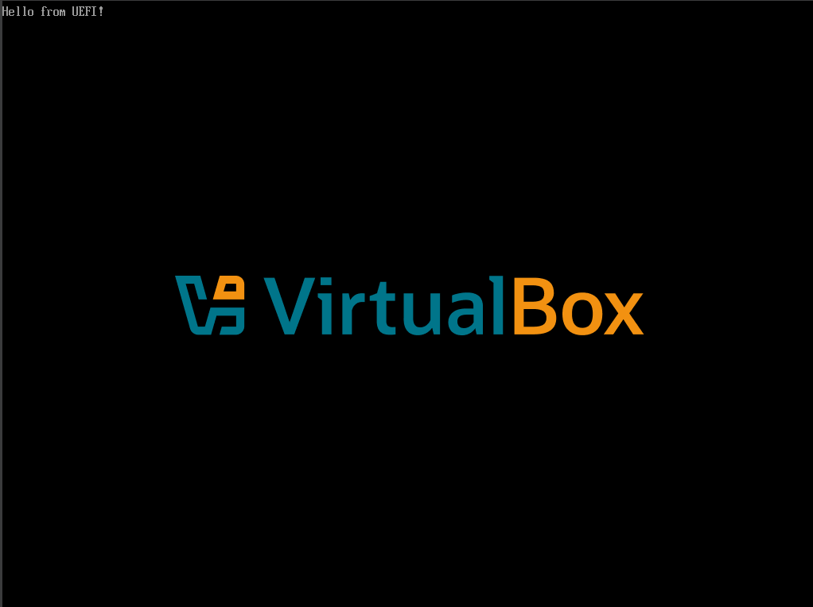
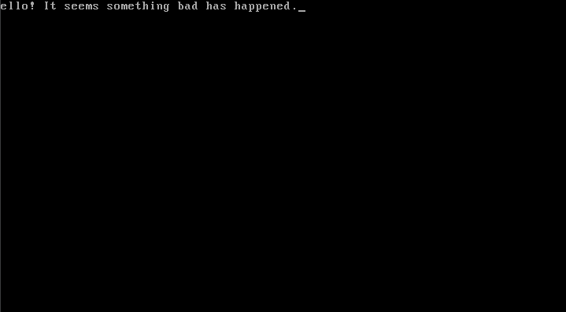

# HELLO

> **H**ijacks **E**FI & **L**egacy **L**oader, **O**verwrites

---

## WARNING - READ BEFORE RUNNING

**THIS TOOL IS FOR EDUCATIONAL AND RESEARCH PURPOSES ONLY.**

- **Do NOT run on any system you care about.**
- **Do NOT run on real hardware.**
- **Use ONLY in a virtual machine (e.g., VirtualBox, QEMU) with a snapshot taken beforehand.**
- **Running this will PERMANENTLY overwrite your boot chain – recovery requires external tools or a reinstall.**

The author is **NOT** responsible for any damage caused by misuse of this software.

---

## What It Does

HELLO is a proof-of-concept boot-level payload that detects your system's firmware and nukes the boot chain accordingly:

- **If UEFI:** Overwrites `\EFI\Microsoft\Boot\bootmgfw.efi` (the Windows Boot Manager) with a custom EFI payload.
- **If Legacy BIOS:** Overwrites the MBR (Master Boot Record) on `PhysicalDrive0` with a custom boot sector.

After the payload is written:
- User input is blocked (`BlockInput(TRUE)`).
- 6 threads are spawned to spam Backspace, destroy windows, toggle the monitor, and invert the screen.
- The C: drive mount point is removed (`DeleteVolumeMountPointA`).
- A hard error is triggered via `NtRaiseHardError` (blue-screen-like).
- The system reboots.

On reboot, instead of Windows, you'll see:

| UEFI Boot Screen | Legacy Boot Screen |
|------------------|-------------------|
|  |  |

...and then system hangs forever.

---

## The Payloads

### Legacy BIOS (MBR)
A custom 512-byte boot sector written in x86 assembly:
- Sets the screen to text mode.
- Prints the message above.
- Hangs the CPU in an infinite loop.

### UEFI
A Rust UEFI application (`test_efi`) that:
- Initialises the UEFI system.
- Prints `"Hello from UEFI!"`.
- Hangs the CPU in an infinite loop (`cli; hlt`).

---

## Build Instructions

### Prerequisites
- CMake (3.15+)
- MinGW (GCC) on Windows
- Rust (if modifying the EFI payload)

### Build
```bash
mkdir build && cd build
cmake .. -G "MinGW Makefiles"
mingw32-make
```

The output executable (`nuke_lol.exe`) will be renamed to `nuke_lol.exe.danger` to prevent accidental execution.

# Static Linking
To avoid missing DLL errors on target machines, the executable is built with:
```cmake
target_link_options(nuke_lol PRIVATE -static-libgcc -static-libstdc++ -static)
```

# Testing
1. Set up a Windows VM (using VirtualBox, QEMU, etc.)
2. Take a snapshot
3. Copy the compiled binary to the VM.
4. Run it as admin and watch the fireworks!

# Disclaimer

**This project is for security research and educational purposes only.**

The techniques demonstrated here are well-known in the security community and are useful for understanding how bootkits and UEFI malware operate. By studying this code, you can better defend against real-world threats.

**Do NOT use this maliciously.** The author assumes no liability for any misuse.